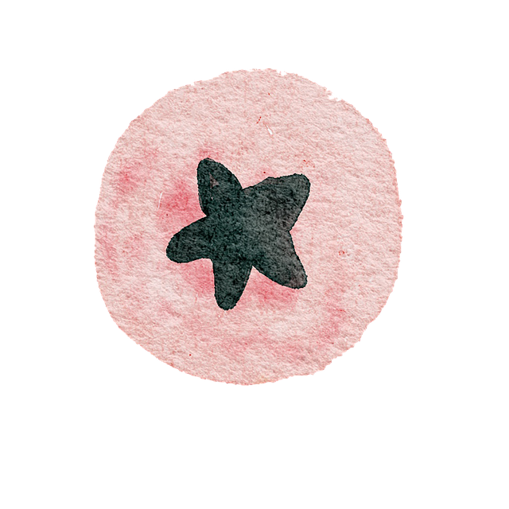

# Landing Page
This project is to create a web page from a [design](https://cdn.statically.io/gh/TheOdinProject/curriculum/81a5d553f4073e593d23a6ab00d50eef8620796d/foundations/html_css/project/imgs/01.png) providing by Odin Project in order to practice HTML and CSS.

# Credits
Images used in the web page are credit from the following creators.
| Image | Creators |
| --- | --- |
|  | [Leeloo The First](https://www.pexels.com/zh-tw/photo/7598007/) |
|  | [Piyapong89](https://pixabay.com/illustrations/avocado-fruits-watercolor-vintage-7746732/) |
|  | [Piyapong89](https://pixabay.com/illustrations/fruit-purple-fruit-watercolor-7746734/) |
|  | [Piyapong89](https://pixabay.com/illustrations/pear-fruit-watercolor-plant-botany-7746733/) |
|  | [Piyapong89](https://pixabay.com/illustrations/strawberry-fruit-pink-fruit-7746735/) |